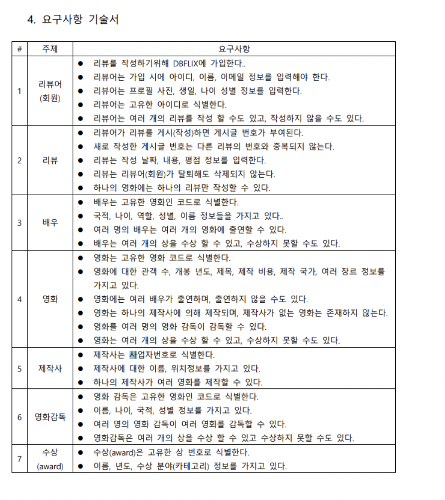
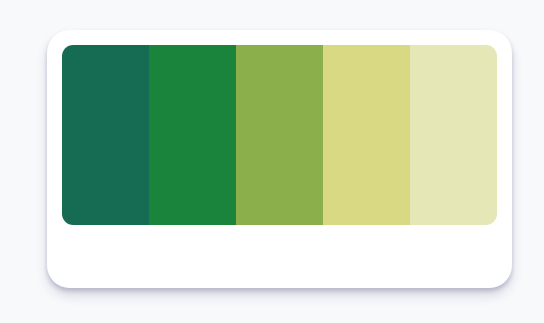

# 영화 사이트 (Hwea)

## 00. 팀원 소개
- [송 준](https://github.com/songjun94) : MAIN PART
- [황지원](https://github.com/hwangjiwon98) : MAIN PART
- [백체은](https://github.com/sairo415) : MODAL PART
- [김동현](https://github.com/soulchicken) : HEADER & FOOTER PART

## 01. 기술 스택
- HTML
- ***React***
- JavaScript
- CSS

## 02. 프로젝트 주제
- 영화 예매, 추천 사이트
- 사이트명 Hwea : 우연히 고른 알파벳의 조합
    - 우연히 만난 팀원이지만 조합하면 조화로운 프로젝트가 나오듯이 우연히 고른 알파벳 조합을 필기체로 조화롭게 그리면 멋있게 나온다는 뜻

## 03. 도메인 관련 용어
- 예매율 (예매관객율) : `(100 * 해당 영화 티켓 / 전체 티켓) (%)` .
    - (일정 기간동안) 팔린 좌석 점유율
- 영화 순위 : 현재 예매율의 순위

## 04. 기능 명세
### 04.00. MosCoW

MoSCoW는 요구사항의 우선순위를 정하는 간편한 방법론으로 Must Have, Should Have, Could Have, Won't Have의 줄임말 입니다. 대강 감이 오시겠지만 한국말로 조금 의역하면 다음과 같습니다.
- [ **M** ] Must have : 치명적이고 시급성이 있는 꼭 필요한 기능!
- [ **S** ] Should have - 매우 중요하지만... 시급성이 Must have 대비 낮은 기능
- [ **C** ] Could have - 있으면 좋겠는데.. 꼭 있어야 할 필요는 없는 기능
- [ **W** ] Won'have - 가장 덜 중요하고, 효과도 미미한 기능

### 04.01. 기능 명세서

- 메뉴바
    - [ **M** ] 영화, 극장, 예매, 스토어, 이벤트, 혜택 메뉴 클릭 기능
    - [ **S** ] 메뉴 클릭시 해당 페이지로 전환
    - [ **C** ] 사이트내 검색 기능
    - [ **M** ] 사이트 로고를 누르면 홈페이지로 복귀한다

- 사용자
    - [ **C** ] 즐겨찾기 기능
    - [ **C** ] 페이지 사용자는 자율적으로 예고편 중지 및 재생 시킬 수 있다

- 회원
    - [ **M** ] 회원은 영화를 예매할 수 있다
    - [ **S** ] 회원은 마이페이지 기능을 사용할 수 있다

- 영화
    - [ **C** ] 페이지 방문 즉시 예고편을 자동 재생한다
    - [ **C** ] 예고편은 랜덤으로 재생된다
    - [ **M** ] 포스터를 통해 영화의 정보(영화 이름, 평점 지수, 예매율)를 알 수 있다
    - [ **M** ] 상세보기 버튼 클릭 시, 상세 설명을 볼 수 있다
    - [ **M** ] 상세 설명 팝업 창 이용 시, 닫기 버튼을 누르면 팝업 창이 닫힌다

- 푸터
    - [ **C** ] 제작자들의 소속, 연락할 수 있는 링크
    - [ **C** ] 사이트 로고를 누르면 홈페이지로 복귀한다

<!-- </img><br/> -->


- Color

</img><br/>

```css
.color1 {color: #156c53;}
.color2 {color: #1a833c;}
.color3 {color: #8baf4b;}
.color4 {color: #d9d984;}
.color5 {color: #e5e7b6;}
```

## 05. 화면 UI


## 06. 트러블 슈팅

- 포스터 이미지 정렬 문제
- Card width 정렬 문제
- Modal 연결 문제 (import 경로 오타)
- MenuList Error
- key is not props 
- Modal 창에 모든 목록이 다 뜨는 문제


## 07. 느낀 점
- 송  준 : 컴포넌트의 구조를 계획하는 일이 중요하다는 점을 깨달았고, 팀원들과 함께 코딩하는 점에서 배울 부분이 많았다고 느꼈다.
- 황지원 : 생소하기도 하고 어려운 부분들도 많았지만, 팀원들과 함께 문제를 해결해 나가는 과정이 즐거웠고 의미있는 경험이었습니다
- 백체은 : 응용이라고 하기 민망할 정도로 배운 내용의 반복이었는데 쉽지 않았습니다. 삽질하면서 마음이 힘들었지만 한 달 전에는 이마저도 못했음을 기억하며 정진하겠습니다.
- 김동현 : 내 코드를 읽기 어렵지만 타인의 코드는 더 읽기 어렵다. 코드 읽는 연습을 해야한다.

08. 리펙토링 및 컨벤션 체크
- 최선을 다했습니다.

## 09. 레퍼런스
- [영화 그 이상의 감동. CGV](https://www.cgv.co.kr/)